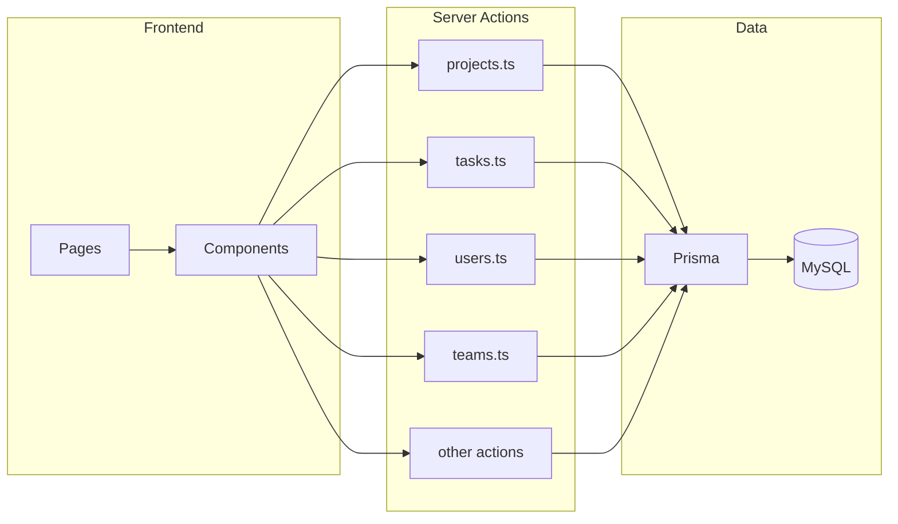

# Service boundaries

Domain boundaries and ownership for the frontend/backend split. Used to decide which server actions belong to which backend module.

## 1. Domain boundaries map

| Domain | Action files | Notes |
|--------|---------------|--------|
| **Projects** | `projects.ts`, `project-types.ts`, `project-statuses.ts`, `project-settings.ts`, `project-notifications.ts`, `project-priority.ts` | Core project CRUD, metadata, settings, notifications, urgent |
| **Tasks** | `tasks.ts`, `task-statuses.ts`, `subtasks.ts`, `dependencies.ts` | Task CRUD, status metadata, subtasks, task dependencies |
| **Users / RBAC** | `users.ts`, `user-settings.ts`, `rbac.ts`, `activity-logs.ts`, `register.ts` | User CRUD, RBAC, activity log read, registration |
| **Teams** | `teams.ts` | Team CRUD and membership |
| **Notifications** | `notifications.ts`, `project-notifications.ts` | Global notifications; project notifications shared with Projects |
| **Settings** | `settings.ts`, `logo-upload.ts` | System/branding settings, logo upload |
| **Reporting / stats** | `reports.ts`, `stats.ts`, `dashboard.ts`, `progress-report.ts` | Reports, stats, dashboard summary, progress report |
| **Focus** | `focus.ts` | Focus board state |
| **Today assignment** | `today-tasks-assignment.ts` | Today's tasks assignment |
| **Attachments** | `attachments.ts` | File upload/list/delete for projects/tasks |
| **Forecasting** | `forecasting.ts` | Forecast data for tasks/projects |

## 2. Recommended first domain to extract

**First domain: Projects**

- **Rationale**: Core entity, clear API surface (CRUD + filters), used by many pages. Extracting it first de-risks the pattern for Tasks and other domains.
- **Initial scope** (candidate endpoints for Phase 1 contract):
  - `getProject(id)`
  - `getProjectsWithFilters(params)`
  - `createProject(formData)`
  - `updateProject(id, formData)`
  - `deleteProject(id)`
  - Optional: `getProjectTypes()`, `getProjectStatuses()` as metadata used by project forms.

Alternative first domain: **Tasks** (similar benefits; can be chosen instead if the team prefers).

## 3. Architecture diagram

Current monolith: pages and components call server actions; all actions use Prisma and MySQL.

## 4. Ownership

- **Until split**: The monolith (single Next.js app) owns all domains. All business logic and data access live in `src/app/actions/*` and API routes.
- **After split**: Each domain will have a backend module (in `apps/backend`) and a frontend adapter/SDK (in `apps/frontend`) that calls the backend API. Contracts are defined in Swagger/OpenAPI and enforced in CI.
